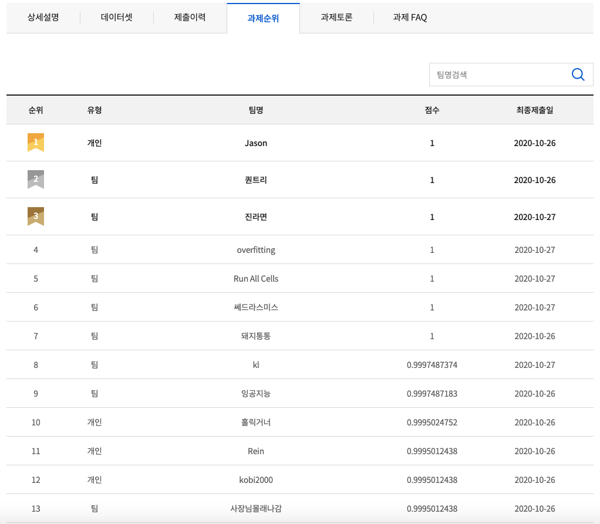
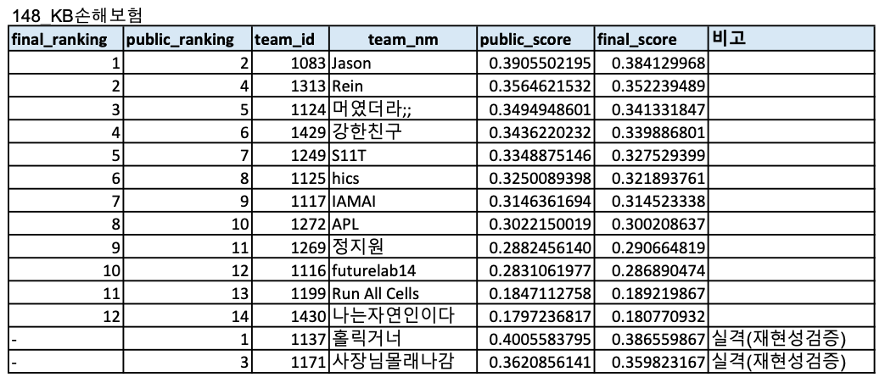

# 2020 인공지능 문제해결 경진대회
- 주최: 과학기술정보통신부
- 주관: 정보통신산업진흥원 (NIPA)

## 예선 (Round 1) : 식물 및 병충해 분류
- Top 1 on Leaderboard (Individual - Jason)

## 본선 (Round 2) : 건축물 구조 분류
- Top 1 on Leaderboard Final (Individual - Jason)

