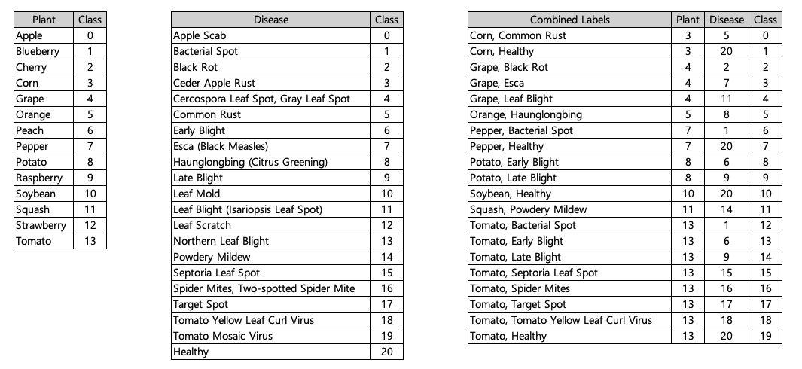
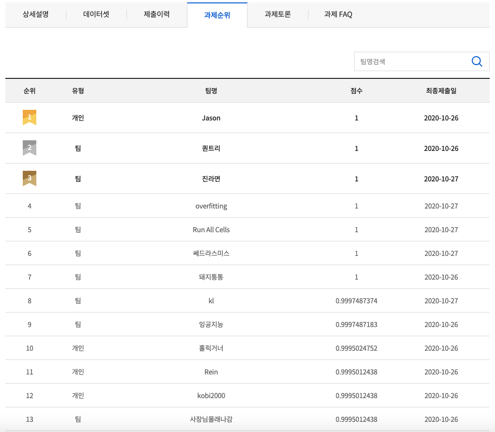

# 2020 인공지능 문제해결 경진대회 예선

## 1. Goal
- Make model that predicts plant and plant disease when RGB images are given

## 2. Intuition
- Choose CNN model
  * ResNet-18 performs best compared with ResNet-34, ResNet-50
  * Large model with small amount of data causes overfit so select small model for generalization
- Generalization
  * Finetune on ImageNet weight
  * Use weight decay
  * Label test data for validation
    * Use trained model and label the test data
    * Update test data label when model ranked high on leaderboard
- Voting Ensemble

## 3. Dataset

- Train : 16,000 images (800 images per Combined Labels)
- Test : 3,997 images

## 4. Train
- Data Pre-processing
  * Resize 256
  * Random crop 224*224
  * Random horizontal flipping
  * Normalization
- Train Details
  * Mini-batch gradient descent based on backpropagation
  * Batch size : 32
  * Learning rate : 0.0001
  * L2 weight decay : 0.000001
  * Learning rate scheduler : decrease to 0.00005, 0.00001 when the validation set accuracy stopped improving

## 5. Test
- Data Pre-processing
  * Resize 256
  * Center crop 224*224
  * Random horizontal flipping
  * Normalization

## 6. Result

- Top 1 on Leaderboard (Individual - Jason)
- F1 Score 1 on Voting Ensemble ResNet-18 Model
- F1 Score 0.9987549011 on Single ResNet-18 Model

## 7. Implementation
### 7.1. Develop Environment
- Docker Image : tensorflow/tensorflow:2.3.1-gpu-jupyter
- Pytorch : Stable (1.6.0) - Linux - Pip - Python - CUDA 10.1

### 7.2. Directory Structure
```
Round 1
├── Figures
├── Implementation
│   ├── best_single.pt
│   ├── dataset.py
│   ├── EDA.ipynb
│   ├── Inference.ipynb
│   ├── Statistics.ipynb
│   ├── Train_Finetune.ipynb
│   ├── train
│   │   ├── train.tsv
│   │   ├── 0.jpg
│   │   ├── 1.jpg
│   │   └── ...
│   ├── test
│   │   ├── test.tsv
│   │   ├── 0.jpg
│   │   ├── 1.jpg
│   │   └── ...
│   └── train.py
└── README.md
```
- Data cannot be uploaded cause of security issue
