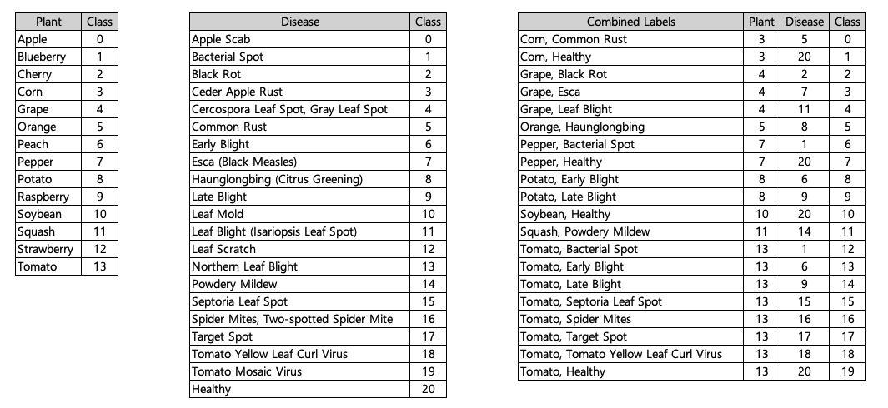

# 2020 인공지능 문제해결 경진대회 예선

## 문제 설명
- 이미지가 주어졌을 때 식물의 종류와 병충해 예측을 하는 네트워크를 만들기
- 평가 지표 : F1 Score
- 데이터
  * Train : 16,000 images (800 images per Combined Labels)
  * Test : 3,997 images
  * 데이터는 보안관리로 인한 제공 불가

## 솔루션 
