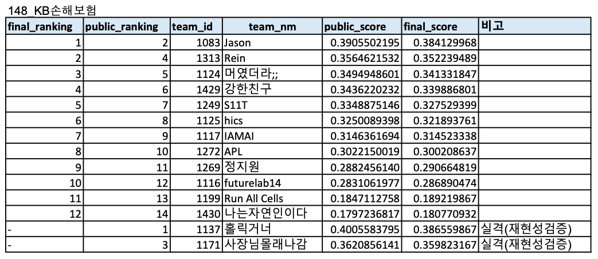

# 2020 인공지능 문제해결 경진대회 본선

## Task 148 건축물 구조 분류


### 1. Goal
- Make model that predicts exterior wall materials when RGB images and meta informations are given

### 2. Intuition
- Choose CNN model
  * ResNet-18 performs best compared with ResNet-34, ResNet-50, EfficientNet-B0, EfficientNet-B1, EfficientNet-B2, EfficientNet-B3, EfficientNet-B4
  * Large model with small amount of data causes overfit so select small model for generalization
- Generalization
  * Finetune model with ImageNet pretrained weight
  * Use weight decay
- Use Meta Information
  * Choose useful meta information and encode to one-hot vector
- Under-Sampling
  * Cause of imbalance data, use undersampling to train model

### 3. Dataset

- Train : 18,429 images
  * Label 0: 12,626 images
  * Label 1: 1,011 images
  * Label 2: 4,734 images
  * Label 3: 29 images
  * Label 4: 29 images
- Test : 5,698 images

### 4. Train
- Data Pre-processing
  * Resize 256
  * Random crop 224*224
  * Random horizontal flipping
  * Normalization
- Train Details
  * Mini-batch gradient descent based on backpropagation
  * Batch size : 32
  * Learning rate : 0.0001
  * L2 weight decay : 0.000001

### 5. Test
- Data Pre-processing
  * Resize 256
  * Center crop 224*224
  * Random horizontal flipping
  * Normalization

### 6. Result



- Top 1 on Leaderboard Final (Individual - Jason)
- Top 2 on Leaderboard Public (Individual - Jason)
- F1 Score 0.3905502195 on Single ResNet-18 + Meta Model

### 7. Implementation
#### 7.1. Develop Environment
- Pytorch : Stable (1.6.0) - Linux - Pip - Python - CUDA 10.1

#### 7.2. Directory Structure
```
Round 2
├── Figures
├── Implementation
│   ├── dataset.py
│   ├── EDA.ipynb
│   ├── Inference.ipynb
│   ├── Statistics.ipynb
│   ├── Train_Finetune.ipynb
│   └── train.py
└── README.md
```
- Data cannot be uploaded cause of security issue
